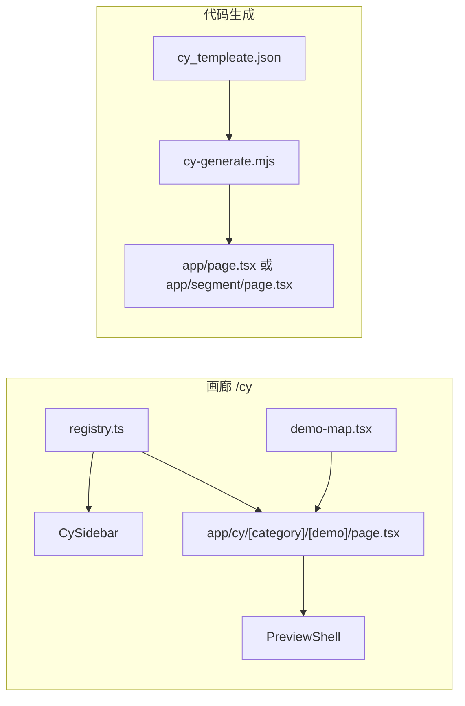

# CY 组件体系：目录说明、加载方式与集成规范

本文说明 `components/cy` 下的职责划分、两条「预览 / 落地」数据路径，以及如何**从零新建一个可复用模块**、要注意什么、规范是什么。文中用**虚构示例 `SpotlightBannerCase1`** 走完全流程；与真实目录 `FAQ/`、`KeyFeature/` 的模式一致，可按同样步骤落地。

---

## 1. 体系在做什么

CY（`components/cy`）包含两类能力，可独立使用，也可组合：

| 能力 | 入口 | 数据从哪来 | 典型用途 |
|------|------|------------|----------|
| **组件画廊** | Next 路由 `/cy/...` | Demo 内多直接 `import cyModulesConfig from "@/components/cy/cy-modules.config.json"` | 在站内浏览各案例、复制配置 JSON |
| **页面代码生成** | `npm run cy`（`scripts/cy-generate.mjs`） | 根目录 `cy_templeate.json` → 生成的 `page.tsx` 内 `import cyTemplate from "@/cy_templeate.json"` | 把多块业务组件纵向堆到同一 App Router 页面 |

**重要：** 生成脚本**只读** `cy_templeate.json`、**只写**目标 `app/.../page.tsx`（及可选脚手架文件），**不会**自动合并或更新 `components/cy/cy-modules.config.json`。根级 **`theme`** 为特例：执行 `npm run cy` 时会**额外**按 `theme` 内容改写 `app/globals.css` 里 **`.dark { ... }`** 中已存在的 CSS 变量（见 **§5.1**）。画廊与生成页若要数据一致，需你自行维护 `cy-modules` 与 `cy_templeate` 的同步（或从 Demo「复制配置」粘贴）。

---

## 2. 加载与路由（心智模型）



- **画廊：** `registry.ts` 定义分类与 Demo 元数据（slug、标题、描述）；`demo-map.tsx` 把 `"category/demo"` 映射到具体 React 组件；动态页把二者接起来并包在 `PreviewShell` 里。
- **生成：** 脚本扫描 `cy_templeate.json` 中带 `__cyComponentPath` 的块，按**对象键在 JSON 中的书写顺序**生成纵向排列的组件树；每块 `data` 来自同文件对应键，并经 `cyBlockData` 剥掉 `__*` 与 `_meta`。顶层键 **`theme`** 不参与上述堆叠（无 `__cyComponentPath`），单独用于暗色主题变量（§5.1）。

---

## 3. 根目录与核心文件

| 路径 | 作用 |
|------|------|
| [`registry.ts`](registry.ts) | **`cyRegistry`**：分类 `slug`、展示名 `label`、子项 `demos`（`slug` / `title` / `description`）。`/cy` 首页会 `redirect` 到 `getDefaultCyRoute()`（第一项分类的第一个 Demo）。`findCyCategory` / `findCyDemo` 供动态页解析路由。 |
| [`demo-map.tsx`](demo-map.tsx) | **`getCyDemoRenderer(category, demo)`**：键为 `` `${category}/${demo}` ``，值为对应 `*Demo.tsx`。新增画廊 Demo **必须**在此增加一行映射，否则动态页 `notFound`。 |
| [`utils.ts`](utils.ts) | **`formatCyModuleConfigEntry` / `copyCyModuleConfigJson`**：把 `cy-modules` 中某 key 格式化为可粘贴 JSON 片段，并可附加 `__cyComponentPath` 等。KeyFeature 相关 **`isKeyFeatureVideoItem`** 等类型守卫。 |
| [`cy-modules.config.json`](cy-modules.config.json) | **运行时全量示例数据**（按业务 key）。Demo 直接 import；**不由** `cy-generate` 自动改写。 |
| [`CyInlineMedia.tsx`](CyInlineMedia.tsx) | 栅格内统一图片 / 视频；视频悬停播放、静音切换。 |
| [`CY_CODEGEN.md`](CY_CODEGEN.md) | 本说明文件。 |
| **Cursor Skill** [`cy-register-module`](../../.cursor/skills/cy-register-module/SKILL.md) | 在 Agent 对话中显式引用后，按固定清单帮你注册新模块、生成与 **KeyFeatureDemo** 一致的宫格与右上角工具栏；详见下文 **§3.1**。 |

### 3.1 Cursor Skill：`cy-register-module`（详细用法）

本仓库在项目目录下提供了 Agent Skill：**[`.cursor/skills/cy-register-module/SKILL.md`](../../.cursor/skills/cy-register-module/SKILL.md)**（配套 **[`reference.md`](../../.cursor/skills/cy-register-module/reference.md)**）。它把下文 **§8 分步教程** 与 **KeyFeatureDemo** 的交互规范收成可执行指令，适合「交给 Cursor 自动改多个文件」而不是手抄步骤。

#### 如何启用（必须显式引用）

Skill 元数据中设置了 **`disable-model-invocation: true`**，即**不会**仅靠「聊天里提到 CY」就自动加载。你需要**主动挂上**本 skill，再描述任务，例如：

1. 在 Cursor **聊天输入框**里输入 **`@`**，在列表中选择 **Skills**（或 **Agent Skills**）下的 **`cy-register-module`**（名称以界面为准，对应目录 `cy-register-module`）。
2. 选中后，输入框里会出现对该 skill 的引用块；**紧接着**写出你的具体需求（见下节示例）。
3. 若使用 **Agent 模式**，同样先 **`@cy-register-module`** 再发任务，以便模型按 `SKILL.md` 内的检查表逐项改仓库。

> 若列表里看不到该 skill：确认文件在 **`nest-template/.cursor/skills/cy-register-module/SKILL.md`**，且 Cursor 已索引当前工作区根目录为该项目。

#### Skill 会做什么（与 §8 的对应关系）

挂上 skill 后，Agent 应按 skill 内检查表顺序处理（与 **§8** 一致，并额外约束 Demo UI）：

| Skill 检查项 | 对应文档 |
|----------------|----------|
| `types.ts` / case / `cy-modules` | §8 第 1～3 步 |
| `*Demo.tsx`（宫格、刷新、全屏、复制、`CyTitleLayoutSelect` 等） | §8 第 4 步 + skill 内「对齐 KeyFeatureDemo」 |
| `registry.ts` / `demo-map.tsx` | §8 第 5～6 步 |
| **`h2` 判定 → 步骤 7** | 见 skill **「步骤 7 触发条件」**：若用户**附件、选区或说明里**的源码出现 **`<h2`**，则必须改 **`cy-title-layout.config.ts`** 的 `defaultCyTitleLayoutByModuleKey`，并在 Demo 里接标题布局与 `mergeRoot.titleLayout`；**无 `<h2`** 则默认跳过步骤 7（除非用户明确要求标题布局） |
| **`cy_templeate.json` + `npm run cy`** | **不在** `cy-register-module` skill 范围内；见 **§8 第 8 步** 与主文档「生成页」章节，由用户单独决定是否维护模板并跑脚本 |
| **Case 文件名序号** | Skill 要求：同一 `components/cy/<Domain>/` 下若已有 `*_case1.tsx`，下一份须为 `*_case2.tsx`，且导出名 / `cy-modules` 键 / 类型名与同一序号对齐（连续递增） |

补充说明：**「拖入一个文件夹」**在 skill 里的含义是：你把 **`components/cy/<某目录>/`** 作为上下文（附件、工作区路径或「请在该目录下…」）交给 Agent；由 Agent **推断** Case 名、`categorySlug` / `demoSlug`，并**补全或创建**缺失文件，而不是仓库里有一个监听文件夹的后台进程。

#### 示例 1：空目录 + 画廊（无现成 UI 代码）

**场景：** 已建好空文件夹 `components/cy/Pricing/`，希望注册 **`PricingTableCase1`**，画廊路由 **`pricing` / `table`**。（生成落地页、维护 `cy_templeate.json` 见 **§8 第 8 步**，勿写进对本 skill 的提示词。）

**推荐提示词（复制后按需改名字）：**

```text
@cy-register-module

在 components/cy/Pricing/ 下新建模块：
- Case 导出名：PricingTableCase1，数据 key 同名（若目录内已有 `*_case1.tsx`，则下一份须为 `*_case2.tsx` 及 `FooCase2` / `FooCase2Data` 等连续序号）
- 画廊：category slug = pricing，demo slug = table，标题「Pricing Table」
- types + case + cy-modules 占位数据 + PricingDemo（对齐 KeyFeature 的宫格与右上角：刷新、全屏、复制、Usage、全屏 Dialog）
- 源码里没有 <h2>，跳过 cy-title-layout.config 步骤 7，除非你认为需要标题布局请说明
```

**你应看到的结果：** Agent 创建/修改多个文件，并在回复里用勾选或列表总结；本地打开 **`/cy/pricing/table`** 验证。

#### 示例 2：从外站页面「迁移」一段带 `<h2>` 的区块（触发步骤 7）

**场景：** 你附上 **`app/page.tsx` 某段**（内含 `<h2>How to Use…</h2>` 与下方三列卡片），希望落成 **`HowToStepsCase1`** 并接 CY 标题体系。

**推荐提示词：**

```text
@cy-register-module

根据我附件里的 page.tsx 选区（含 h2 与三列步骤卡片），在 components/cy/HowToSteps/ 下实现 HowToStepsCase1：
- 用 CyTestimonialTitleCase1 + titleLayout 替代裸 h2
- 执行步骤 7：defaultCyTitleLayoutByModuleKey、Demo 里 CyTitleLayoutSelect 与 copyCyModuleConfigJson 的 mergeRoot
- Demo 交互对齐 KeyFeatureDemo
```

**要点：** 只要上下文里能**看到 `<h2`**，skill 要求 Agent **执行步骤 7**；若你其实不想接标题布局，须在提示词里写清楚「**忽略 h2 规则，不做步骤 7**」。

#### 示例 3：目录里已有 `types` + `case`，只缺画廊与 Demo

**推荐提示词：**

```text
@cy-register-module

components/cy/Spotlight/ 下已有 types 和 spotlight_case1.tsx，请只补：
- cy-modules 的 SpotlightBannerCase1 示例
- SpotlightBannerDemo（完整 KeyFeature 风格工具栏）
- registry + demo-map
- 不要改 case 内部业务逻辑
```

#### 使用后的自检（与 §8 第 9 步一致）

- **`/cy/<category>/<demo>`** 能打开、无 404。
- Demo 内 **刷新 / 全屏 / 复制** 行为正常；若做了步骤 7，**标题布局下拉**与复制出的 **`titleLayout`** 一致。
- 需要生成页时：**`npm run cy`** / **`npm run cy:check`**（与 `cy-register-module` skill 无关，见 §8 第 8 步）。

#### 与纯手动的关系

- **只读文档 §7～§8、不用 skill**：完全可行，步骤不变。
- **使用 skill**：减少漏改 `demo-map`、漏接工具栏、漏判 **`h2` → 步骤 7** 等问题；具体文件名仍以本文 **§8、§9** 与仓库现有模块为准。

---

## 4. 子目录职责（按功能）

### 4.1 `layout/`

| 文件 | 作用 |
|------|------|
| `PreviewShell.tsx` | 画廊单页外壳：分类标签、Demo 标题、描述 + 子内容区。 |
| `Sidebar.tsx`（`CySidebar`） | 基于 `cyRegistry` 渲染 `/cy/{category}/{demo}` 导航。 |
| `ThemeCustomizer.tsx` | 画廊顶栏：主色预览（`localStorage` + 运行时 `:root`）；**「复制 theme」** 生成可粘贴进 `cy_templeate.json` 的 `theme` 片段（见 §5.1）。 |

`app/cy/layout.tsx` 组合上述组件。

### 4.2 `headerLayout/`

标题区布局：`cy-title-layout.config.ts`、`CyTitleLayoutSelect.tsx`、`cy-testimonial-title.tsx`、`common/` 等。模块里若用 **`CyTestimonialTitleCase1`** 且需要「布局下拉与默认 id」，见 [`headerLayout/README.md`](headerLayout/README.md)。

### 4.3 业务模块子树（推荐结构）

每个业务域一个文件夹，例如 `FAQ/`、`KeyFeature/`：

| 文件 | 是否必需 | 说明 |
|------|----------|------|
| `types.ts` | 强烈建议 | 导出 `XxxData`、子项类型，与 JSON 一一对应，避免 `any`。 |
| `xxx_case1.tsx` | 是（至少一个 case） | **具名导出**展示组件，props 一般为 `{ data: XxxData }`。 |
| `XxxDemo.tsx` | 画廊需要 | Client 组件：`"use client"`；读 `cy-modules`；多 case 时用本地 state 切换；提供「复制 JSON」调用 `copyCyModuleConfigJson`。 |
| `README.md` | 可选 | 字段字典、设计说明（复杂模块如 KeyFeature 已有）。 |

### 4.4 `app/cy/cases/`

个别固定路由页，直接从 `cy-modules` 取 key。新建模块**优先**走 `registry` + `demo-map`，不必再增加 `cases`，除非你需要与画廊无关的独立 URL。

---

## 5. `cy_templeate.json` 与生成页约定

- **顶层键**：须与要渲染的 React 组件**导出名**完全一致（生成页里是 `<VideoHeroCase1 data={...} />` 这种形式）。
- **`__cyComponentPath`**：指向该组件源码的 import 路径；**有**此字段的块才会出现在生成页中；缺失时脚本告警并跳过。
- **以 `__` 开头的键**：不进入 `data`，生成前删除。
- **`_meta`**：不进入 `data`；可配置 `generateComponent` 让脚本写出包装文件（见 `scripts/cy-generate.mjs`）。

生成页注释中含 **`source: cy_templeate.json`**；`cy:check` 时若目标 page 无该标记则跳过内容比对。

### 5.1 根级 `theme`（暗色主题变量 → `globals.css` 的 `.dark`）

用于把**落地页暗色模式**下的主色及相关变量写进仓库，避免仅靠画廊里的运行时改色、`npm run cy` 后又回到默认 `globals.css`。

| 项目 | 说明 |
|------|------|
| **在 JSON 里的位置** | `cy_templeate.json` **根对象**上的 **`"theme"`** 键；值为普通对象，**不要**写 `__cyComponentPath`。 |
| **值的格式** | 键须为 **CSS 自定义属性名**（以 `--` 开头，如 `"--primary"`），值为 **字符串**，内容为 **`oklch(...)`**（与 `app/globals.css` 中 `.dark` 块现有写法一致）。 |
| **推荐字段** | 与画廊 [`ThemeCustomizer.tsx`](layout/ThemeCustomizer.tsx) 复制结果对齐即可，一般包含：`--primary`、`--primary-foreground`、`--ring`、`--sidebar-primary`、`--sidebar-primary-foreground`、`--sidebar-ring`。可按需增删，但脚本**只会替换 `.dark` 里已存在的行**，不会在 `.dark` 里自动插入新属性名。 |
| **如何得到 JSON** | 在 **`/cy`** 打开画廊 → 顶栏调色 → 点 **「复制 theme（OKLCH）」** → 将剪贴板中的 JSON（根级含 `"theme": { ... }`）合并进 `cy_templeate.json`（可整体替换根对象的 `theme` 字段）。 |
| **执行 `npm run cy` 时** | `scripts/cy-generate.mjs` 读取根级 `theme`，在 **`app/globals.css`** 中定位 **`.dark { ... }`**（按大括号配对），对 **`theme` 中出现的每个 `--*` 键**：若 `.dark` 内已有同名声明，则**替换该行的取值**；不写 `page.tsx` 中的组件、不参与 `cyBlockData`。 |
| **不写 `cy:check` 时的 theme** | 当前实现仅在**非 check** 生成流程中改写 `globals.css`；`npm run cy:check` 只校验页面，不应用 `theme`。 |
| **与组件数据的关系** | `theme` **不会**作为某块的 `data` 传给 React；生成页 `import cyTemplate` 后仍只对带 `__cyComponentPath` 的 key 调用组件。 |

**小结：** `theme` = 与页面块**并列**的、专门给构建脚本用的「暗色主题补丁」；改色流程：**画廊复制 → 粘贴 `cy_templeate.json` → `npm run cy` → `.dark` 与仓库同步**。

---

## 6. 命令与环境变量（`package.json` + CLI）

| 命令 | 行为 |
|------|------|
| `npm run cy` | 写入 `app/page.tsx` |
| `npm run cy:check` | 不写盘，校验生成结果 |
| `npm run cy:<segment>` | 写入 `app/<segment>/page.tsx`（单段 token） |
| `npm run cy:check:<segment>` | 校验对应 segment 的 page |
| `node scripts/cy-generate.mjs --segment foo/bar` | `app/foo/bar/page.tsx` |
| `npm run cy -- preview` | 等价 `--segment preview`（仅 `cy` 后**一个**路径参数时） |

含 `/` 的路径用 CLI `--segment`，勿依赖 npm 脚本名里的斜杠（视 `package.json` 是否已配置而定）。

---

## 7. 新建模块：你要先想清楚的两件事

### 7.1 是否需要画廊 `/cy/...`

- **需要：** 必须在 `registry.ts` + `demo-map.tsx` 登记，并实现 `*Demo.tsx`。
- **不需要：** 可以只做「业务组件 + `cy-modules` 里的 key」，在任意页面 `import` 使用；此时**不必**改 `registry` / `demo-map`。

### 7.2 是否需要 `npm run cy` 生成落地页

- **需要：** 在根目录 `cy_templeate.json` 增加与组件导出名相同的键，并提供 `__cyComponentPath`。
- **不需要：** 不必维护 `cy_templeate` 里该块；业务页手写 `<YourCase data={...} />` 即可。

下面**举例**假设两者都要：新模块 **`SpotlightBannerCase1`**，分类挂在 **`marketing`** 下，Demo slug **`spotlight`**。

---

## 8. 分步教程（举例：`SpotlightBannerCase1`）

### 第 1 步：定数据形状，写 `types.ts`

在 `components/cy/Spotlight/types.ts`（新建目录）定义与 JSON 一致的类型：

```ts
export interface SpotlightBannerCase1Data {
  eyebrow: string;
  title: string;
  body: string;
  ctaLabel: string;
  ctaHref: string;
}
```

**注意：** 字段名一旦写入 `cy-modules.config.json` 与 `cy_templeate.json`，改名将影响所有引用处；优先一次定好命名（camelCase 与现有模块一致）。

---

### 第 2 步：实现 Case 组件（具名导出 + `data`）

`components/cy/Spotlight/spotlight_banner_case1.tsx`：

- 若使用 hooks、事件、`useState` 等，文件顶部加 **`"use client"`**。
- 导出函数名 **`SpotlightBannerCase1`** 将与 `cy_templeate` 顶层 key、生成页中的 JSX 标签一致。
- Props 统一为 **`{ data: SpotlightBannerCase1Data }`**，便于生成脚本与复制代码片段一致。

```tsx
"use client";

import Link from "next/link";
import type { SpotlightBannerCase1Data } from "@/components/cy/Spotlight/types";

export function SpotlightBannerCase1({ data }: { data: SpotlightBannerCase1Data }) {
  return (
    <section className="rounded-xl border bg-card p-8">
      <p className="text-sm text-muted-foreground">{data.eyebrow}</p>
      <h2 className="mt-2 text-2xl font-semibold">{data.title}</h2>
      <p className="mt-2 text-muted-foreground">{data.body}</p>
      <Link
        href={data.ctaHref}
        className="mt-4 inline-flex cursor-pointer rounded-md bg-primary px-4 py-2 text-primary-foreground"
      >
        {data.ctaLabel}
      </Link>
    </section>
  );
}
```

**规范小结：**

- 可点击的 `button` / `Link` 等加 **`cursor-pointer`**（项目约定）。
- 不要用默认导出承载「生成页用的主组件」，否则 `cy-generate` 按**模板 key** 生成标签，仍需与导出名一致；具名导出最清晰。

---

### 第 3 步：在 `cy-modules.config.json` 增加示例数据

在 JSON 根对象增加一项（key 建议与组件名一致，便于全局搜索）：

```json
"SpotlightBannerCase1": {
  "eyebrow": "New",
  "title": "Ship faster with CY blocks",
  "body": "Compose sections from JSON-driven components.",
  "ctaLabel": "Read docs",
  "ctaHref": "/cy"
}
```

**不要**在这里写 `__cyComponentPath`：那是剪贴板复制给 `cy_templeate` 用的元数据，`cy-modules` 只存**业务字段**。

---

### 第 4 步：画廊 Demo 组件 `SpotlightBannerDemo.tsx`

参考 [`FAQ/CollapsibleFaqDemo.tsx`](FAQ/CollapsibleFaqDemo.tsx) 的模式：

1. **`"use client"`**。
2. `import cyModulesConfig from "@/components/cy/cy-modules.config.json"`。
3. 渲染 `<SpotlightBannerCase1 data={cyModulesConfig.SpotlightBannerCase1 as SpotlightBannerCase1Data} />`（或本地 state 切换多 case）。
4. 「复制配置」按钮里调用：

```ts
import { copyCyModuleConfigJson } from "@/components/cy/utils";

await copyCyModuleConfigJson("SpotlightBannerCase1", cyModulesConfig, {
  sourceFilePath: "@/components/cy/Spotlight/spotlight_banner_case1.tsx",
});
```

复制到剪贴板的内容会多带 **`__cyComponentPath`**，用户粘贴进 `cy_templeate.json` 后，路径与生成脚本 import 一致。

若模块使用标题区并要一并复制标题布局 id，可传 `titleComponentId` / `titleComponentPath` / `mergeRoot`（见 `utils.ts` 内 `CopyCyModuleConfigOptions`）。

---

### 第 5 步：注册画廊路由 — `registry.ts`

1. 扩展联合类型 **`CyCategorySlug`**，增加 `"marketing"`（若为新分类）。
2. 在 **`cyRegistry`** 数组中增加一项：

```ts
{
  slug: "marketing",
  label: "Marketing",
  demos: [
    {
      slug: "spotlight",
      title: "Spotlight Banner",
      description: "Eyebrow + 标题 + 正文 + 单 CTA 的轻量横幅。",
    },
  ],
},
```

**注意：** `slug` 只允许 URL 安全字符；与 `demo-map` 的键片段必须一致。

---

### 第 6 步：绑定 Demo 组件 — `demo-map.tsx`

增加一行 import 与 map 条目：

```tsx
import { SpotlightBannerDemo } from "@/components/cy/Spotlight/SpotlightBannerDemo";

const demoMap = {
  // ...existing
  "marketing/spotlight": SpotlightBannerDemo,
};
```

键必须是 **`${category.slug}/${demo.slug}`**，即 **`marketing/spotlight`**。漏写会导致 `/cy/marketing/spotlight` 返回 **404**。

---

### 第 7 步（可选）：标题布局默认值 — `headerLayout/cy-title-layout.config.ts`

若该模块使用 **`CyTestimonialTitleCase1`** 且配置里有 `titleLayout` 字符串 id，在 **`defaultCyTitleLayoutByModuleKey`** 中为 **`SpotlightBannerCase1`** 增加一行默认 id（如 `"headerVertical"`），避免 Demo 里写死魔法字符串。不涉及标题组件的模块可跳过。

---

### 第 8 步（可选）：接入 `cy_templeate.json` + `npm run cy`

在仓库根目录 `cy_templeate.json` 增加与**导出名相同**的键（可与 `cy-modules` 结构相同，并多加 `__cyComponentPath`）：

```json
"SpotlightBannerCase1": {
  "eyebrow": "New",
  "title": "Ship faster with CY blocks",
  "body": "Compose sections from JSON-driven components.",
  "ctaLabel": "Read docs",
  "ctaHref": "/cy",
  "__cyComponentPath": "@/components/cy/Spotlight/spotlight_banner_case1.tsx"
}
```

执行 **`npm run cy`** 后，`app/page.tsx` 会出现类似：

```tsx
import { SpotlightBannerCase1 } from "@/components/cy/Spotlight/spotlight_banner_case1";
import cyTemplate from "@/cy_templeate.json";

// cyBlockData 会去掉 __* 与 _meta
<SpotlightBannerCase1 data={cyBlockData(cyTemplate["SpotlightBannerCase1"] as Record<string, unknown>) as never} />
```

**顺序：** `cy_templeate.json` 里多个顶层块时，**书写顺序**即页面从上到下的堆叠顺序。调整顺序即调整落地页布局。

**`theme`：** 若根对象存在 **`theme`**，执行 `npm run cy` 时会按 **§5.1** 更新 `app/globals.css` 的 `.dark`；`theme` 不参与本步的组件堆叠顺序。

**校验：** `npm run cy:check` 确认生成内容与磁盘一致。

---

### 第 9 步：本地自检清单

| 检查项 | 如何做 |
|--------|--------|
| 类型与 JSON 对齐 | `SpotlightBannerCase1Data` 能覆盖 `cy-modules` 中该 key 无 `any` |
| 画廊可打开 | 浏览器访问 `/cy/marketing/spotlight` |
| 复制 JSON | Demo 内复制 → 粘贴到 `cy_templeate` 后保留 `__cyComponentPath` |
| 生成页 | `npm run cy` 后看首页（或指定 segment）是否渲染、控制台无报错 |
| `theme`（可选） | 若使用根级 `theme`：`npm run cy` 后检查 `app/globals.css` 的 `.dark` 中对应变量是否已更新（§5.1） |
| Lint / 构建 | `npm run lint` / `npm run build` |

---

## 9. 规范速查表

| 主题 | 规范 |
|------|------|
| Case 组件导出 | **具名函数**，名称 = `cy_templeate` 顶层 key = 生成页标签名 |
| Props | **`{ data: XxxData }`** |
| `cy-modules.config.json` | 仅业务字段；**无** `__` 前缀键 |
| `cy_templeate.json` | 参与生成页的块必须有 **`__cyComponentPath`**；`__*` 不进组件。例外：**根级 `theme`** 无 `__cyComponentPath`，用于改写 **`globals.css` → `.dark`**（§5.1） |
| 画廊 | **`registry`** 与 **`demo-map`** 的 slug 组合唯一且一致 |
| 交互元素 | **`cursor-pointer`** |
| 栅格内图片 / 视频 | 优先 **`CyInlineMedia`**（与 KeyFeature 等现有一致） |
| 客户端 | 需要浏览器 API / hooks 的组件加 **`"use client"`**；生成页本身可为 Server Component |

---

## 10. 与真实模块的对照

| 步骤 | FAQ 目录中的对应参考 |
|------|----------------------|
| types | [`FAQ/types.ts`](FAQ/types.ts) |
| case | [`FAQ/faq_case1.tsx`](FAQ/faq_case1.tsx)（`FaqCase1` + `CollapsibleFaqProps`） |
| Demo + 复制 | [`FAQ/CollapsibleFaqDemo.tsx`](FAQ/CollapsibleFaqDemo.tsx) |
| 复杂配置说明 | [`KeyFeature/README.md`](KeyFeature/README.md) |

按上表对照「虚构 Spotlight」的步骤，即可在 FAQ / KeyFeature 同级新增真实模块。

---

## 11. 相关仓库路径速查

| 路径 | 说明 |
|------|------|
| [`cy_templeate.json`](../../cy_templeate.json) | 生成页数据源模板 |
| [`scripts/cy-generate.mjs`](../../scripts/cy-generate.mjs) | 生成与校验逻辑 |
| [`app/cy/[category]/[demo]/page.tsx`](../../app/cy/[category]/[demo]/page.tsx) | 画廊动态页 |
